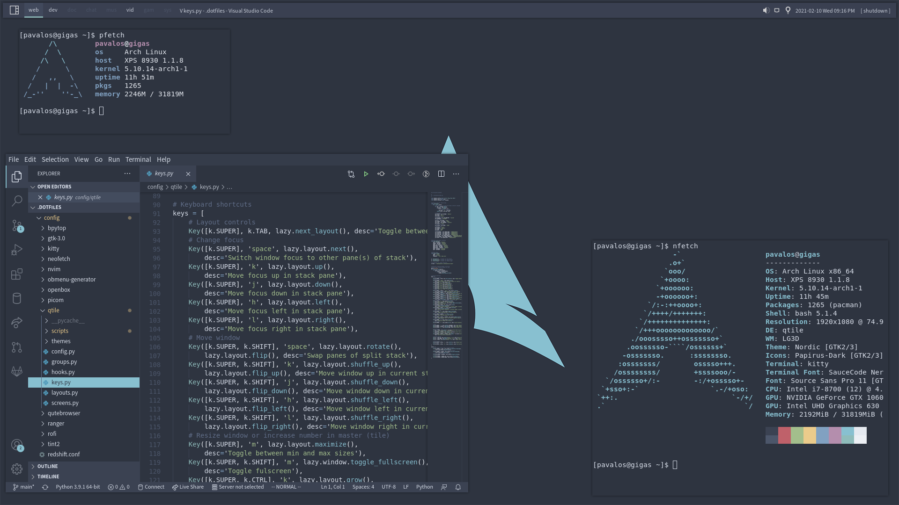

# Qtile Config

## About

My qtile config is split across various python files, to ease with readibility
and with configurability.

## Requirements

`qtile`

- Fonts: `adobe-source-code-pro-fonts`, `nerd-fonts-complete` (AUR)
- Screenshots: `maim`, `xclip`
- Browser: `firefox`
- Terminal: `kitty`
- Compositor: `picom`
- Volume control: `pamixer`
- Screen information: `python-xlib`
- Applets: `network-manager-applet`, `pasystray`, `redshift`

## TODO

- Edit the 'themes' layout, the way it is configured at the moment requires
  two separate changes in `screens` and in `layouts.py`
